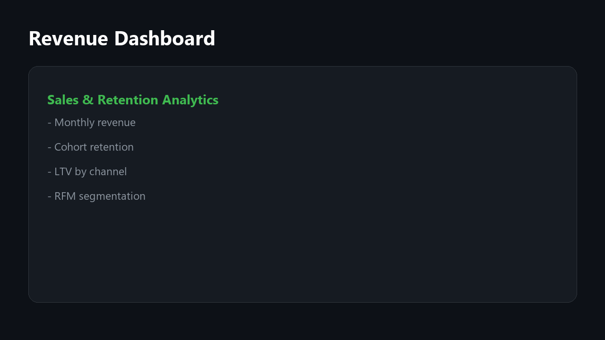
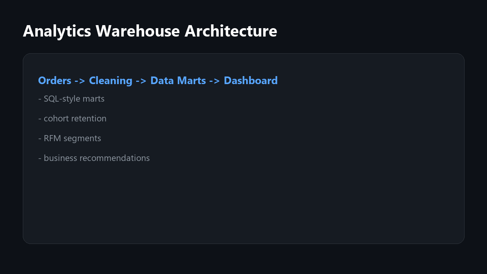

# Sales Retention Analytics Warehouse

    

    ## Project Overview

    End-to-end analytics warehouse for sales, retention, cohort reporting, LTV, RFM segmentation, and business recommendations.

    ## Business Problem

    Many businesses rely on manual data collection, spreadsheets, and repeated browser actions. This creates slow workflows, human errors, outdated reports, and poor visibility into business metrics.

    ## Solution

    This project automates the workflow: data collection, cleaning, validation, structured storage, analytical metrics, dashboard/report output, and production-style tests/CI.

    ## Architecture

    

    ```text
    Data Sources -> Validation & Cleaning -> Analytical Models -> API / Dashboard / Reports
    ```

    ## Features

    - Clean project structure
    - Sample data and reproducible analytics
    - Validation and transformation logic
    - Analytical metrics
    - Dashboard/report-ready output
    - Dockerized setup
    - Automated tests
    - GitHub Actions CI

    ## Tech Stack

    Python, SQL, PostgreSQL, pandas, Streamlit, Docker, pytest

    ## Database Schema

    Main entities:

    - customers
- orders
- cohorts
- rfm_segments
- analytical_marts

    ## Data Pipeline

    ```text
    Raw data -> pandas transformations -> metrics -> business conclusions -> dashboard/report
    ```

    ## API Endpoints

    - GET /health
- GET /analytics/summary
- GET /analytics/cohorts
- GET /analytics/rfm

    ## Dashboard Screenshots

    

    ## Analytics Results

    - Best channel by LTV is calculated from transactional data.
- Cohort retention highlights repeat-purchase behavior.
- RFM segments separate VIP, loyal, at-risk, and dormant customers.

    ## How to Run

    ```bash
    python -m pip install -e .
    pytest
    docker compose up --build
    ```

    ## Tests

    ```bash
    pytest
    ```

    The test suite covers transformation logic, metrics, validation/scoring rules, and output generation.

    ## Engineering Notes

    This project is designed as a production-style portfolio system, not a one-file script. It includes modular architecture, configuration, Docker setup, automated tests, CI, sample data, docs, and business-facing conclusions.

    ## Known Limitations

    - Demo data is used for portfolio purposes.
    - External integrations are represented with sample data or replaceable adapters.
    - Historical analysis becomes stronger as more data is collected.

    ## Future Improvements

    - Add PostgreSQL persistence
    - Add authentication
    - Add background workers
    - Add advanced anomaly detection
    - Add export to PDF/Excel reports
